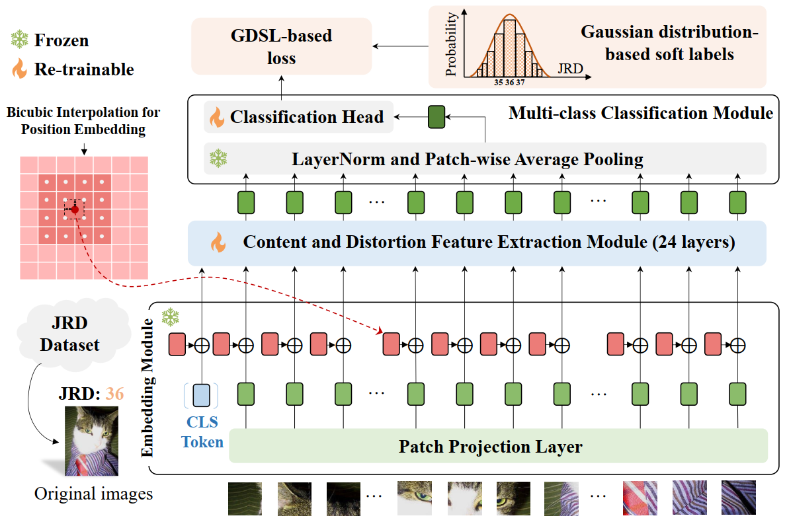

# DT-JRD


[](https://arxiv.org/abs/2411.09308)


DT-JRD: Deep Transformer-based Just Recognizable Difference Prediction Model for Video Coding for Machines \
[[paper]](https://arxiv.org/abs/2411.09308) [[code]](https://github.com/JunqiLiu-SYSU/DT-JRD) \
[Junqi Liu](https://github.com/JunqiLiu-SYSU), [Yun Zhang](https://codec.siat.ac.cn/yunzhang/), [Xiaoqi Wang](https://github.com/XiaoqiWang), [Long Xu](https://scholar.google.com.sg/citations?hl=en&user=PBqivgkAAAAJ&view_op=list_works&sortby=pubdate), [Sam Kwong](https://scholars.ln.edu.hk/en/persons/sam-tak-wu-kwong) \
*IEEE Transactions on Multimedia (TMM), 2025*

## Abstract
Just Recognizable Difference (JRD) represents the minimum visual difference that is detectable by machine vision, which can be exploited to promote machine vision-oriented visual signal processing. In this paper, we propose a Deep Transformer-based JRD (DT-JRD) prediction model for Video Coding for Machines (VCM), where the accurately predicted JRD can be used to reduce the coding bit rate while maintaining the accuracy of machine tasks.
Firstly, we model the JRD prediction as a multi-class classification and propose a DT-JRD prediction model that integrates an improved embedding, a content and distortion feature extraction, a multi-class classification, and a novel learning strategy. 
Secondly, inspired by the perception property that machine vision exhibits a similar response to distortions near JRD, we propose an asymptotic JRD loss by using Gaussian Distribution-based Soft Labels (GDSL), which significantly extends the number of training labels and relaxes classification boundaries.
Finally, we propose a DT-JRD-based VCM to reduce the coding bits while maintaining the accuracy of object detection.
Extensive experimental results demonstrate that the mean absolute error of the predicted JRD by the DT-JRD is 5.574, outperforming the state-of-the-art JRD prediction model by 13.1\%.
Coding experiments show that compared with the VVC, the DT-JRD-based VCM achieves an average of 29.58\% bit rate reduction while maintaining the object detection accuracy.
<p align="center">
  
</p>

## Requirements

🧩 This project was trained and tested with:

- 🐍 **Python** 3.10.14

📦 To install required packages, simply run:

```bash
pip install -r requirements.txt
```
## 🗂️ Project Directory Structure
```
DT-JRD
├── jsonfiles/
│   ├── all_GT_classes.json
│   ├── all_objects_infos.json
│   ├── coco80_indices.json
│   ├── JRD_info.json
│   ├── test_names.json
│   ├── train_names.json
│   └── val_names.json
├── data/
│   ├── original/
│   └── distorted/
├── pre_weights/
│   └── pretrained_vit.pth
├── train.py
├── test.py
├── dataset.py
├── model.py
└── utils.py
```

📥 The pretrained ViT weights can be downloaded from:  
- [ViT-L/32](https://github.com/rwightman/pytorch-image-models/releases/download/v0.1-vitjx/jx_vit_large_patch32_224_in21k-9046d2e7.pth)  
- [ViT-B/32](https://github.com/rwightman/pytorch-image-models/releases/download/v0.1-vitjx/jx_vit_base_patch32_224_in21k-8db57226.pth)

## 📊 Dataset
(1) In this work and our previous study ([[paper]](https://ieeexplore.ieee.org/document/10349945) [[code]](https://github.com/SYSU-Video/Learning-to-Predict-Object-Wise-Just-Recognizable-Distortion-for-Image-and-Video-Compression)), we use the [OW-JRD (Object-wise Just Recognizable Distortion)](https://ieee-dataport.org/documents/object-wise-just-recognizable-distortion-dataset) dataset. The dataset consists of original and distorted images of detected **objects** from the COCO test set. The prediction models presented in this paper are trained and validated on the OW-JRD dataset. DT-JRD is a no-reference model, and therefore only the original data is required. In contrast, BC-JRD is a full-reference model, which necessitates both the original and distorted data for training and validation.  
(2) In addition, we provide the [*JRD image dataset*](https://pan.baidu.com/s/1T6kdpvSqx9WIZ-Flg9-90A) (*extraction code: hrrn*), which consists of 8,471 original *images* selected from the COCO test set along with 64 corresponding distorted versions. The OW-JRD dataset is constructed based on the JRD image dataset, which also enables secondary development for customized dataset construction and experiments involving VVC encoding.

## Train
<pre> python train.py --size 384 --epochs 20 --batchsize 32 --lr 0.01 --gpus 0,1 --device cuda:0 </pre>

## Test
<pre> python test.py --train_weights your_checkpoint_path </pre>

## 📖 Citation

If you find our work useful or relevant to your research, please kindly cite our paper:

```bibtex
@article{liu2024dt,
  title={DT-JRD: Deep Transformer based Just Recognizable Difference Prediction Model for Video Coding for Machines},
  author={Liu, Junqi and Zhang, Yun and Wang, Xiaoqi and Long, Xu and Kwong, Sam},
  journal={arXiv preprint arXiv:2411.09308},
  year={2024}
}
